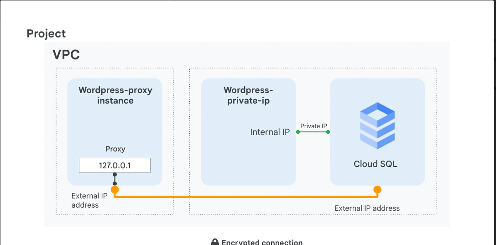
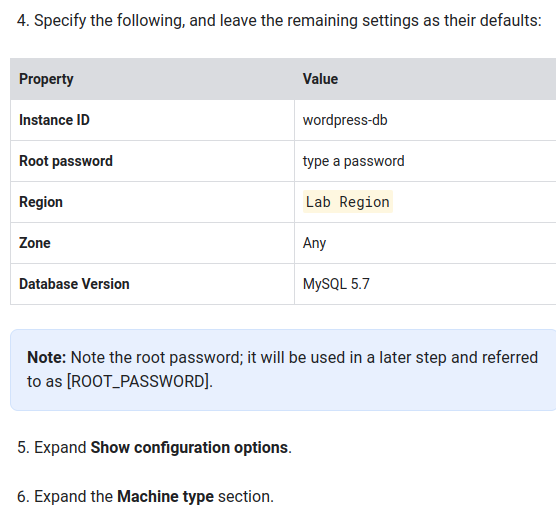
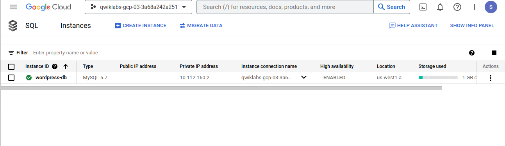
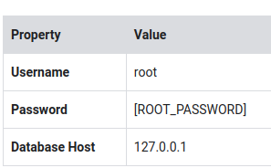
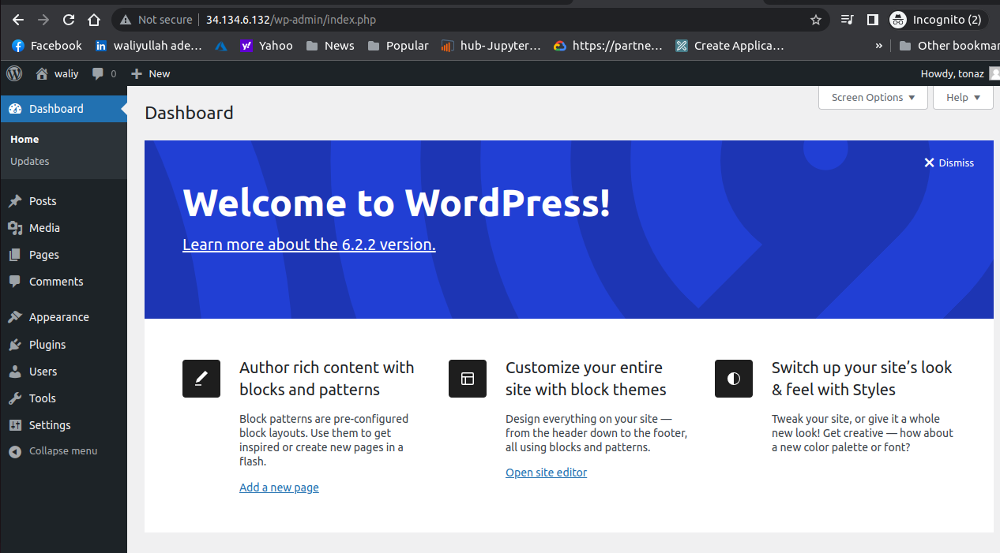
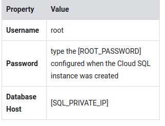
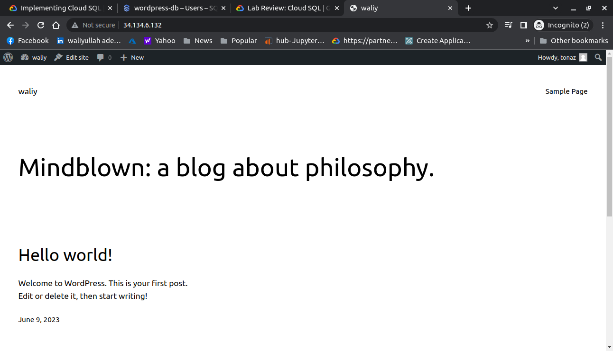

## Implementing Cloud SQL

For each lab, you get a new Google Cloud project and set of resources for a fixed time at no cost.

Sign in to Qwiklabs using an incognito window.

When ready, click Start lab.

Note your lab credentials (Username and Password). You will use them to sign in to the Google Cloud Console.

Click Open Google Console.

Click Use another account and copy/paste credentials for this lab into the prompts.
If you use other credentials, you'll receive errors or incur charges.

Accept the terms and skip the recovery resource page.

## Task 1. Create a Cloud SQL database
In this task, you configure a SQL server according to Google Cloud best practices and create a Private IP connection.

On the Navigation menu (Navigation menu icon), click **SQL**. 
Click Create instance. 
Click Choose MySQL. 
Specify the following, and leave the remaining settings as their defaults: 
  

Provision the right amount of vCPU and memory. To choose a **Machine Type**, click the dropdown menu, and then explore your options.
For this lab, select standard from the dropdown menu, and then select 1 vCPU, 3.75 GB.  

Next, expand the Storage section and then choose Storage type and Storage capacity.  
Expand the Connections section.  

Select Private IP.   

In the Network dropdown, select default.   

Click the Set up Connection button that appears.   

In the panel to the right, click Enable API, click Use an automatically allocated IP range, click Continue, and then click Create Connection.   

Click Create Instance at the bottom of the page to create the database instance.   
  
## Configure a proxy on a virtual machine

When your application does not reside in the same VPC connected network and region as your Cloud SQL instance, use a proxy to secure its external connection. 
In order to configure the proxy, you need the Cloud SQL instance connection name.  

On the Navigation menu (Navigation menu icon) click Compute Engine.  

Click SSH next to wordpress-proxy.  

Download the Cloud SQL Proxy and make it executable:  

      wget https://dl.google.com/cloudsql/cloud_sql_proxy.linux.amd64 -O cloud_sql_proxy && chmod +x cloud_sql_proxy

In order to start the proxy, you need the connection name of the Cloud SQL instance. Keep your SSH window open and return to the Cloud Console.  

On the Navigation menu (Navigation menu icon), click SQL.  

Click on the wordpress-db instance and wait for a green checkmark next to its name, which indicates that it is operational (this could take a couple of minutes).  

Note the Instance connection name; it will be used later and referred to as [SQL_CONNECTION_NAME].  

In addition, for the application to work, you need to create a table. Click Databases.  

Click Create database, type wordpress, which is the name the application expects, and then click Create.  

Return to the SSH window and save the connection name in an environment variable, replacing [SQL_CONNECTION_NAME] with the unique name you copied in a previous step:  

    export SQL_CONNECTION=[SQL_CONNECTION_NAME]
To verify that the environment variable is set, run:

    echo $SQL_CONNECTION
The connection name should be printed out.

To activate the proxy connection to your Cloud SQL database and send the process to the background, run the following command:  

    ./cloud_sql_proxy -instances=$SQL_CONNECTION=tcp:3306 &

Press **ENTER**.

## Connect an application to the Cloud SQL instance
In this task, you will connect a sample application to the Cloud SQL instance.  

Configure the Wordpress application. To find the external IP address of your virtual machine, query its metadata:

    curl -H "Metadata-Flavor: Google" http://169.254.169.254/computeMetadata/v1/instance/network-interfaces/0/access-configs/0/external-ip && echo

Go to the **wordpress-proxy** external IP address in your browser and configure the Wordpress application.

Click **Let's Go.**

Specify the following, replacing [ROOT_PASSWORD] with the password you configured upon machine creation, and leave the remaining settings as their defaults:
  

Click Submit.  

When a connection has been made, click Run the installation to instantiate Wordpress and its database in your Cloud SQL. This might take a few moments to complete.  

Populate your demo site's information with random information and click Install Wordpress. You won't have to remember or use these details.  

When a 'Success!' window appears, remove the text after the IP address in your web browser's address bar and press ENTER.
You'll be presented with a working Wordpress Blog!

## Connect to Cloud SQL via internal IP
If you can host your application in the same region and VPC connected network as your Cloud SQL, you can leverage a more secure and performant configuration using Private IP.  

By using Private IP, you will increase performance by reducing latency and minimize the attack surface of your Cloud SQL instance because you can communicate with it exclusively over internal IPs.  

In the Cloud Console, on the Navigation menu (Navigation menu icon), click SQL.
Click wordpress-db.  
Note the Private IP address of the Cloud SQL server; it will be referred to as [SQL_PRIVATE_IP].  
On the Navigation menu, click Compute Engine.  

Copy the external IP address of wordpress-private-ip, paste it in a browser window, and press ENTER.  

Click Let's Go.  

Specify the following, and leave the remaining settings as their defaults:  
  
Click **Submit ** 
Click Run the installation.  
An 'Already Installed!' window is displayed, which means that your application is connected to the Cloud SQL server over private IP.  

In your web browser's address bar, remove the text after the IP address and press ENTER.
You'll be presented with a working Wordpress Blog!  

In this lab,  have created a Cloud SQL database and configured it to use both an external connection over a secure proxy and a Private IP address, which is more secure and performant. Remember that you can only connect via Private IP if the application and the Cloud SQL server are collocated in the same region and are part of the same VPC network. If your application is hosted in another region, VPC, or even project, use a proxy to secure its connection over the external connection.